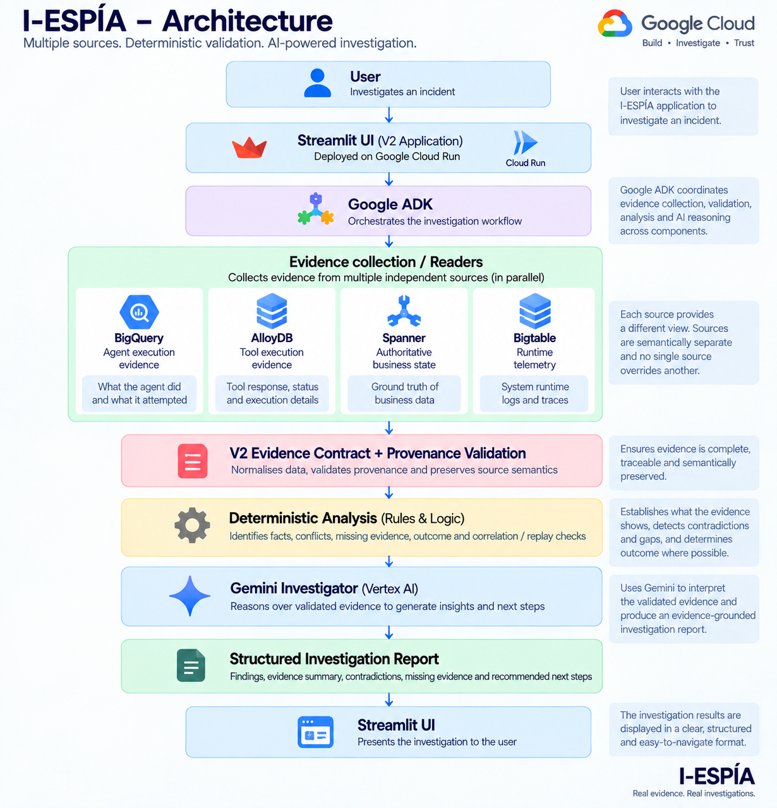

# I-ESPÍA | AI-Agent Incident Evidence Investigator

> **Don't guess what the agent did. Reconstruct what the evidence can prove.**

**I-ESPÍA — Incident Evidence Sequence, Prediction & Investigation Agent** is an evidence-driven incident investigation platform designed for incidents involving AI agents, tools, APIs, and business systems.

AI agents are increasingly capable of reading requests, making decisions, calling tools, updating records, interacting with APIs, and performing actions on behalf of users.

But this creates a critical investigation problem:

> **When an AI agent performs an action, how do we know what actually happened?**

A tool can report **SUCCESS**.

The authoritative business system can report **UNCHANGED**.

Both observations can be valid.

I-ESPÍA is designed to investigate exactly this kind of contradiction by reconstructing incidents from independent evidence sources rather than assuming that one system's status represents the complete truth.

---

## Project Links

### 🚀 Live Application

**I-ESPÍA | AI Incident Investigator**

[https://i-espia-507010118680.asia-south1.run.app/](https://i-espia-507010118680.asia-south1.run.app/)

### 📝 Project Story

**Medium — I-ESPÍA: When an AI Agent Says "Done", How Do We Know It Actually Happened?**

[Read the full Medium article](https://medium.com/@angelainfanta1312/i-esp%C3%ADa-when-an-ai-agent-says-done-how-do-we-know-it-actually-happened-aa59a269581e)

## 🎥 Project Walkthrough

*Project walkthrough showing the I-ESPÍA evidence-first investigation workflow, including multi-source evidence reconstruction, contradiction detection, and handling of incomplete evidence.*

**[Watch the project walkthrough on YouTube →](https://youtu.be/PmY6J1DWWBM)**

<a href="https://youtu.be/PmY6J1DWWBM">
  
</a>

---

# Table of Contents

- [The Problem](#the-problem)
- [The Core Idea](#the-core-idea)
- [What Makes I-ESPÍA Different](#what-makes-i-espía-different)
- [A Simple Incident Example](#a-simple-incident-example)
- [Four Evidence Sources](#four-evidence-sources)
- [Evidence Semantics](#evidence-semantics)
- [Investigation Pipeline](#investigation-pipeline)
- [Deterministic Analysis](#deterministic-analysis)
- [Gemini Investigation](#gemini-investigation)
- [Google ADK](#google-adk)
- [Handling Uncertainty](#handling-uncertainty)
- [Architecture](#architecture)
- [Technology Stack](#technology-stack)
- [Repository Structure](#repository-structure)
- [Controlled Evaluation](#controlled-evaluation)
- [Evaluation Scenarios](#evaluation-scenarios)
- [Google Cloud Implementation](#google-cloud-implementation)
- [Networking](#networking)
- [Security and IAM](#security-and-iam)
- [Local Development](#local-development)
- [Docker](#docker)
- [Cloud Run Deployment](#cloud-run-deployment)
- [Design Principles](#design-principles)
- [V1 → V2 Evolution](#v1--v2-evolution)
- [Future Direction](#future-direction)
- [Project Team](#project-team)
- [Project Philosophy](#project-philosophy)

---

# The Problem

AI agents are moving beyond simply answering questions.

They can now:

- interpret user requests;
- make decisions;
- call tools;
- invoke APIs;
- update records;
- interact with business systems;
- perform multi-step workflows;
- and act autonomously on behalf of users.

That creates a new incident-investigation challenge.

When an AI agent performs an action, **the agent's execution record, the tool's response, the runtime telemetry, and the actual business state may not agree.**

Consider an AI-powered customer-support agent.

A customer asks:

> "Please update the payment account associated with my order."

The agent understands the request and calls a backend tool.

The tool responds:

```text
SUCCESS
```

At first glance, the operation appears successful.

But an investigator checks the authoritative business database:

```text
UNCHANGED
```

So what happened?

Did the AI fail?

Did the tool fail?

Was the operation attempted but never committed?

Was it a no-op?

Was there an issue between execution and the final business state?

The important answer is:

> **We don't know yet.**

The evidence is fragmented across systems, and each system is answering a different question.

---

# The Core Idea

I-ESPÍA does not begin by asking:

> **"What probably happened?"**

It begins by asking:

> **"What does each piece of evidence actually tell us?"**

The system then:

1. Collects evidence from independent sources.
2. Preserves the semantic meaning and provenance of each source.
3. Correlates the evidence.
4. Performs deterministic analysis.
5. Identifies contradictions and missing evidence.
6. Establishes the business outcome where authoritative evidence is available.
7. Passes the validated evidence package to Gemini.
8. Uses Google ADK to orchestrate the investigation workflow.
9. Produces a structured, evidence-grounded investigation.

The goal is not to produce the most confident explanation.

The goal is to produce the **strongest explanation the evidence can actually support**.

---

# What Makes I-ESPÍA Different?

I-ESPÍA is deliberately different from a generic chatbot, log viewer, or conventional infrastructure RCA platform.

Its focus is the **AI agent as an actor inside an incident**.

### I-ESPÍA:

- reconstructs agent behaviour from evidence;
- correlates independent evidence sources;
- preserves the semantic boundary between different systems;
- separates tool execution from authoritative business state;
- detects contradictions deterministically;
- explicitly identifies missing evidence;
- distinguishes facts from hypotheses;
- preserves uncertainty;
- uses Gemini for reasoning only after evidence validation;
- provides evidence references for important conclusions.

### The key distinction

A tool saying:

```text
SUCCESS
```

does **not** automatically mean:

```text
Business operation = SUCCESS
```

Likewise:

```text
FAILURE
```

does not automatically mean:

```text
Business operation = FAILURE
```

The contradiction itself is evidence.

---

# A Simple Incident Example

Suppose an AI agent attempts to update a customer account.

### Agent evidence

```text
Action: UPDATE_ACCOUNT
Status: SUCCESS
```

### Tool evidence

```text
Tool: account_tool
Execution: SUCCESS
```

### Runtime telemetry

```text
Tool call observed
Runtime status: SUCCESS
```

### Authoritative business state

```text
Account state: UNCHANGED
```

A conventional investigation might conclude:

> "The account update succeeded because the tool returned SUCCESS."

I-ESPÍA instead identifies:

```text
TOOL_SUCCESS_VS_STATE_UNCHANGED
```

and reports:

- the agent attempted the operation;
- the tool reported success;
- runtime telemetry observed the execution;
- the authoritative business state remained unchanged;
- therefore the evidence is contradictory;
- the underlying cause cannot be established from these observations alone.

This distinction is central to I-ESPÍA.

---

# Four Evidence Sources

One of the most important architectural decisions is that I-ESPÍA uses **four independent evidence sources**, each with a fixed semantic role.

| Source | Role | What it can establish |
|---|---|---|
| **BigQuery** | Agent execution evidence | What the agent received, accessed, attempted, and recorded |
| **AlloyDB** | Tool execution evidence | What the downstream tool execution reported |
| **Spanner** | Authoritative business state | The authoritative business outcome/state when available |
| **Bigtable** | Runtime telemetry | Supporting runtime observations such as tool calls, retries, and runtime events |

---

## 1. BigQuery — What Did the Agent Do?

BigQuery provides evidence about the **agent's execution**.

It can contain information such as:

- incident ID;
- timestamp;
- event type;
- actor;
- action;
- status;
- details;
- correlation ID.

BigQuery answers:

> **What did the agent receive, attempt, or record?**

---

## 2. AlloyDB — What Did the Tool Report?

AlloyDB provides **tool execution evidence**.

Tool execution records can contain:

- execution IDs;
- tool names;
- requests;
- responses;
- actions;
- execution status;
- execution timing.

For example:

```text
Execution: EXEC-001
Tool: account_tool
Action: UPDATE_ACCOUNT
Status: SUCCESS
```

AlloyDB answers:

> **What did the tool execution report?**

It does not automatically establish the final business outcome.

---

## 3. Spanner — What Happened to the Business State?

Spanner represents the **authoritative business state**.

If the investigation question is:

> "Did the customer's account actually change?"

the authoritative business-state evidence is critical.

For example:

```text
Account: ACC-001
State: UNCHANGED
Version: 10
```

Spanner answers:

> **What happened to the authoritative business state?**

---

## 4. Bigtable — What Happened at Runtime?

Bigtable provides **runtime telemetry**.

It can provide supporting observations around:

- tool calls;
- retries;
- runtime events;
- execution status;
- correlation information.

Bigtable answers:

> **What happened during runtime?**

Runtime telemetry is supporting evidence, not authoritative business state.

---

# Evidence Semantics

The four-source boundary is intentional.

**No source gets to overwrite another source's meaning.**

The system maintains the following semantic boundaries:

```text
BigQuery
   ↓
Agent execution evidence

AlloyDB
   ↓
Tool execution evidence

Spanner
   ↓
Authoritative business state

Bigtable
   ↓
Runtime telemetry
```

Therefore:

```text
Tool SUCCESS
≠
Business SUCCESS
```

and:

```text
Tool FAILURE
≠
Business FAILURE
```

Similarly:

```text
Runtime SUCCESS
≠
Authoritative business SUCCESS
```

This prevents a single execution signal from being incorrectly promoted into a business outcome.

---

# Investigation Pipeline

I-ESPÍA follows an **evidence-first investigation pipeline**.

```text
Incident
   │
   ▼
Collect Evidence
   │
   ├── BigQuery
   ├── AlloyDB
   ├── Spanner
   └── Bigtable
   │
   ▼
Normalize Evidence
   │
   ▼
Validate Evidence & Provenance
   │
   ▼
Deterministic Analysis
   │
   ├── Confirmed facts
   ├── Conflicts
   ├── Missing evidence
   ├── Outcome confirmation
   ├── Repeated executions
   └── Correlation consistency
   │
   ▼
Validated Investigation Context
   │
   ▼
Google ADK
   │
   ▼
Gemini Investigator
   │
   ▼
Structured Investigation
   │
   ▼
Streamlit UI
```

The sequence is deliberate:

> **Evidence first. Validation second. Deterministic analysis third. AI reasoning after that.**

---

# Deterministic Analysis

The deterministic layer establishes what the evidence says before Gemini is asked to interpret it.

It is responsible for identifying things such as:

- confirmed facts;
- conflicting evidence;
- missing evidence;
- outcome confirmation;
- repeated executions;
- duplicate/replay behaviour;
- correlation inconsistencies;
- source availability.

For example:

```text
AlloyDB:
Tool status = SUCCESS

Spanner:
State = UNCHANGED
```

The deterministic layer can establish:

```text
TOOL_SUCCESS_VS_STATE_UNCHANGED
```

Gemini does not need to decide whether the contradiction exists.

That fact is established deterministically.

Gemini can instead investigate:

> What are the possible explanations for this contradiction?

This separation reduces the risk of unsupported LLM conclusions.

---

# Gemini Investigation

Gemini is not used as a magical root-cause generator.

Its role is to **reason over evidence that has already been collected and validated**.

For example, if I-ESPÍA establishes:

- the agent attempted an account update;
- the tool reported SUCCESS;
- runtime telemetry observed the execution;
- Spanner reports UNCHANGED;

Gemini can formulate possible explanations such as:

- the tool may have reported success before a downstream state change was committed;
- the operation may have resulted in a no-op;
- an intermediate process may have prevented the state transition;
- the available evidence may be insufficient to determine the cause.

These remain:

> **Possible explanations / hypotheses**

They are not automatically promoted to confirmed root cause.

---

# Google ADK

Google Agent Development Kit (ADK) provides the orchestration layer for the investigation workflow.

The architecture separates:

### Deterministic logic

> Establishes what the evidence says.

### Gemini

> Reasons about what the validated evidence might mean.

### ADK

> Orchestrates the investigation workflow.

This gives the system a clear division of responsibility:

```text
Evidence
   ↓
Deterministic validation
   ↓
Validated investigation context
   ↓
ADK orchestration
   ↓
Gemini reasoning
   ↓
Structured investigation
```

The ADK investigator is intentionally bounded by the validated evidence supplied by the I-ESPÍA workflow.

---

# Handling Uncertainty

One of the most important behaviours of I-ESPÍA is its ability to say:

> **"We don't have enough evidence to know yet."**

Suppose the authoritative business state is unavailable.

A conventional AI system may still attempt to provide a confident explanation.

I-ESPÍA instead preserves the evidence boundary.

For example:

```text
Business outcome:
UNCONFIRMED

Missing evidence:
Authoritative business state unavailable
```

The system then recommends what should be checked next.

This means uncertainty is treated as a legitimate investigation result rather than something the AI should hide.

---

# Architecture

*Figure 1 — I-ESPÍA V2 evidence-first multi-database architecture.*
---

# Technology Stack

## Application

- Python 3.13
- Streamlit
- Pydantic

## AI and Agent Orchestration

- Google ADK
- Gemini
- Vertex AI
- Google Gen AI SDK

## Evidence Systems

- Google BigQuery
- Google Cloud Spanner
- AlloyDB for PostgreSQL
- Google Cloud Bigtable

## Google Cloud Infrastructure

- Google Cloud Run
- Google Artifact Registry
- IAM
- VPC
- Cloud DNS
- Private Service Connect

## Development

- Git
- GitHub
- Docker
- Google Cloud CLI
- Application Default Credentials
- Antigravity IDE

---

# Repository Structure

```text
Patchamomma26/
│
├── contracts/
│   └── matched_adk_v1_evaluation_results.json
│
├── evaluation/
│   ├── matched_adk_v1_evaluation.py
│   └── v2_fixture_reader.py
│
├── processor/
│   ├── adk/
│   │   ├── __init__.py
│   │   ├── investigator.py
│   │   └── tests/
│   │       └── test_runner.py
│   │
│   ├── gemini_investigator.py
│   └── tests/
│       └── test_v2_four_db_integration.py
│
├── ui/
│   └── app.py
│
├── .dockerignore
├── Dockerfile
├── requirements.txt
└── README.md
```

The repository separates:

- evidence processing;
- deterministic analysis;
- ADK investigation;
- Gemini reasoning;
- evaluation;
- UI;
- deployment configuration.

---

# Controlled Evaluation

The MVP uses controlled synthetic incident evidence so that scenarios can be deliberately constructed with known expected relationships.

This allows repeatable testing of:

- normal successful operations;
- contradictory tool/business outcomes;
- missing authoritative evidence;
- duplicate/replay behaviour;
- incomplete evidence;
- correlation consistency;
- evidence provenance;
- Gemini input construction.

The controlled V2 evaluation achieved:

> **7/7 PASS**

for the four-source evidence path and deterministic analysis.

Evidence aggregation, provenance preservation, conflict handling, and Gemini-input construction were also validated.

---

# Evaluation Scenarios

| Scenario | Purpose |
|---|---|
| **INC-001** | Tool SUCCESS vs authoritative state UNCHANGED |
| **INC-002** | Clean successful operation |
| **INC-003** | Successful operation with incomplete audit/evidence context |
| **INC-004** | Tool FAILURE vs authoritative state UPDATED |
| **INC-005** | Successful operation with incomplete audit/evidence context |
| **INC-006** | Duplicate/replay behaviour with two tool executions |
| **INC-007** | Authoritative evidence unavailable; outcome cannot be confirmed |

The evaluation deliberately includes contradictory and incomplete scenarios rather than testing only successful workflows.

---

# Example Investigation Outcomes

### Scenario A — Tool SUCCESS / State UNCHANGED

```text
Tool:
SUCCESS

Authoritative state:
UNCHANGED

Result:
CONFLICT
```

The system must not claim that the business operation succeeded.

---

### Scenario B — Tool FAILURE / State UPDATED

```text
Tool:
FAILURE

Authoritative state:
UPDATED

Result:
CONFLICT
```

The system must not claim that the business operation failed simply because the tool reported FAILURE.

---

### Scenario C — Authoritative Evidence Missing

```text
Tool:
SUCCESS

Authoritative state:
UNAVAILABLE
```

Result:

```text
Business outcome:
UNCONFIRMED
```

The system identifies the missing evidence instead of inventing a conclusion.

---

### Scenario D — Duplicate/Replay Behaviour

If two tool executions are correlated with the same incident, I-ESPÍA can preserve that execution history and surface repeated execution behaviour as part of the investigation.

---

# Google Cloud Implementation

I-ESPÍA uses Google Cloud services throughout the investigation pipeline.

## BigQuery

Stores structured agent execution evidence.

## AlloyDB

Stores tool execution evidence.

## Spanner

Stores authoritative business/account state.

## Bigtable

Stores runtime telemetry.

## Vertex AI / Gemini

Provides investigation reasoning.

## Google ADK

Orchestrates the investigation workflow.

## Cloud Run

Hosts the deployed Streamlit application.

## Artifact Registry

Stores the Docker container image.

---

# Networking

The V2 architecture uses private connectivity for AlloyDB.

The relevant path is:

```text
Cloud Run
    │
    ▼
VPC
    │
    ▼
Private Service Connect
    │
    ▼
AlloyDB
```

Cloud DNS provides the required private name resolution for the AlloyDB PSC endpoint.

This allows the application to access AlloyDB without relying on a public database endpoint.

---

# Security and IAM

I-ESPÍA uses Google Cloud IAM and service-account-based authentication.

The application uses:

- Cloud Run service identity;
- Application Default Credentials;
- Google Cloud IAM;
- Vertex AI authentication;
- database-specific read permissions;
- service-account impersonation where required for AlloyDB connectivity.

The application does **not** rely on hard-coded Gemini API keys.

Secrets must never be committed to the repository.

The repository should not contain:

```text
API keys
Passwords
Database credentials
Service-account private keys
OAuth secrets
Private certificates
```

The investigation architecture is also designed around read-only evidence access.

The investigator is an analysis system, not an unrestricted autonomous operator.

---

# Local Development

## Prerequisites

Install:

- Python 3.13
- Docker
- Git
- Google Cloud CLI

Verify:

```bash
python --version
docker --version
git --version
gcloud --version
```

---

## Clone the Repository

```bash
git clone https://github.com/angelainfanta1312/Patchamomma26.git
cd Patchamomma26
```

---

## Create a Virtual Environment

Windows:

```bash
python -m venv .venv
.venv\Scripts\activate
```

Install dependencies:

```bash
pip install -r requirements.txt
```

---

# Authentication

I-ESPÍA uses Google Cloud Application Default Credentials.

Authenticate locally:

```bash
gcloud auth application-default login
```

Set the Google Cloud project:

```bash
gcloud config set project project-448c7b37-cc7c-4c20-9d9
```

Vertex AI authentication is handled through Google Cloud credentials.

No Gemini API key should be stored in source code.

---

# Running the Application

Start Streamlit:

```bash
streamlit run ui/app.py
```

The application presents an incident investigation interface where users can inspect:

- agent execution evidence;
- tool execution evidence;
- authoritative business state;
- runtime telemetry;
- conflicts;
- missing evidence;
- business outcome;
- Gemini findings;
- hypotheses;
- recommended next checks;
- uncertainty;
- evidence references.

---

# Running Tests

Run the full test suite:

```bash
pytest
```

Run the four-database integration test:

```bash
pytest processor/tests/test_v2_four_db_integration.py
```

Run the ADK test runner:

```bash
python processor/adk/tests/test_runner.py
```

---

# Docker

Build the application image:

```bash
docker build -t i-espia:local .
```

Run locally:

```bash
docker run -p 8080:8080 i-espia:local
```

The included Dockerfile uses Python 3.13 and starts Streamlit on port `8080`.

---

# Artifact Registry

The V2 container image is stored in Google Artifact Registry.

Configure Docker authentication:

```bash
gcloud auth configure-docker asia-south1-docker.pkg.dev
```

Tag the image:

```bash
docker tag i-espia:local \
  asia-south1-docker.pkg.dev/project-448c7b37-cc7c-4c20-9d9/patchamomma/i-espia:v2.1
```

Push:

```bash
docker push \
  asia-south1-docker.pkg.dev/project-448c7b37-cc7c-4c20-9d9/patchamomma/i-espia:v2.1
```

---

# Cloud Run Deployment

The V2 application is deployed as a separate Cloud Run service:

```text
Service:
i-espia

Region:
asia-south1
```

Example deployment:

```bash
gcloud run deploy i-espia \
  --image=asia-south1-docker.pkg.dev/project-448c7b37-cc7c-4c20-9d9/patchamomma/i-espia:v2.1 \
  --project=project-448c7b37-cc7c-4c20-9d9 \
  --region=asia-south1 \
  --service-account=patchamomma-run@project-448c7b37-cc7c-4c20-9d9.iam.gserviceaccount.com \
  --network=default \
  --subnet=default \
  --vpc-egress=private-ranges-only
```

---

# Vertex AI Configuration

The Cloud Run service uses Vertex AI authentication.

The relevant environment configuration is:

```text
GOOGLE_GENAI_USE_VERTEXAI=TRUE
GOOGLE_CLOUD_PROJECT=project-448c7b37-cc7c-4c20-9d9
GOOGLE_CLOUD_LOCATION=global
```

Example:

```bash
gcloud run services update i-espia \
  --region=asia-south1 \
  --project=project-448c7b37-cc7c-4c20-9d9 \
  --set-env-vars="GOOGLE_GENAI_USE_VERTEXAI=TRUE,GOOGLE_CLOUD_PROJECT=project-448c7b37-cc7c-4c20-9d9,GOOGLE_CLOUD_LOCATION=global"
```

---

# Design Principles

## 1. Evidence Before Explanation

The system collects and validates evidence before generating an explanation.

```text
Evidence
   ↓
Validation
   ↓
Deterministic analysis
   ↓
AI reasoning
```

---

## 2. Independent Sources Have Different Meanings

The system does not flatten every record into one generic log stream.

Each source has a specific evidentiary role.

---

## 3. Tool SUCCESS Is Not Business SUCCESS

A tool response describes the tool's reported execution result.

It does not automatically establish the final business state.

---

## 4. Tool FAILURE Is Not Business FAILURE

A tool can report failure while an underlying operation has already affected business state.

Therefore the authoritative state must be checked independently.

---

## 5. Contradictions Are Evidence

If two independent sources disagree, the disagreement itself is meaningful.

The system should surface the conflict rather than silently choosing one source.

---

## 6. Deterministic Before Probabilistic

Rules that can be evaluated deterministically should be established before involving an LLM.

---

## 7. Hypotheses Must Remain Hypotheses

A plausible explanation is not a confirmed root cause.

The system explicitly separates:

```text
Confirmed fact
        ≠
Possible explanation
```

---

## 8. Missing Evidence Is a Result

If required evidence is unavailable, the correct investigation result may be:

```text
UNCONFIRMED
```

rather than a guessed answer.

---

## 9. Traceability

Important conclusions should remain traceable to their underlying evidence.

An investigator should be able to ask:

> **Why did the system reach this conclusion?**

and:

> **Which evidence supports it?**

---

## 10. AI Is the Investigator, Not the Source of Truth

The databases provide evidence.

The deterministic layer validates and correlates evidence.

Gemini interprets the validated evidence.

ADK orchestrates the investigation.

The UI presents the result.

---

# V1 → V2 Evolution

I-ESPÍA evolved from a single-source investigation pipeline into a multi-source evidence architecture.

## V1

```text
BigQuery
   ↓
Deterministic Processor
   ↓
Gemini
   ↓
Streamlit
   ↓
Cloud Run
```

## V2

```text
BigQuery ─── Agent Evidence
     │
AlloyDB ──── Tool Evidence
     │
Spanner ──── Authoritative State
     │
Bigtable ─── Runtime Telemetry
     │
     ▼
Evidence Correlation
     │
     ▼
Deterministic Analysis
     │
     ▼
Google ADK
     │
     ▼
Gemini
     │
     ▼
Structured Investigation
     │
     ▼
Streamlit
     │
     ▼
Cloud Run
```

V2 therefore expands the investigation from a primarily agent/log-centric view into a **multi-perspective evidence reconstruction system**.

---

# Current Deployment

The current V2 deployment is:

```text
Application:
I-ESPÍA | AI Incident Investigator

Cloud Run service:
i-espia

Region:
asia-south1

Runtime:
Streamlit

Container:
Docker

AI:
Gemini / Vertex AI + Google ADK

Evidence:
BigQuery + AlloyDB + Spanner + Bigtable
```

### Live application

https://i-espia-507010118680.asia-south1.run.app/

---

# Future Direction

The architecture is designed so that additional evidence systems and controlled investigation tools can be introduced without changing the semantic meaning of the existing sources.

Future improvements could include:

- additional evidence sources;
- richer evidence provenance;
- more deterministic conflict rules;
- expanded ADK investigation tools;
- automated regression evaluation;
- improved event timeline visualization;
- richer missing-evidence detection;
- expanded incident scenarios;
- production-scale observability;
- additional security hardening.

Optional technologies should only be introduced when they provide a genuine architectural or operational benefit.

The objective is not to maximize the number of technologies.

The objective is to maximize the **quality and defensibility of the investigation**.

---

# Project Team

**Built by:**

### Angela Infanta Ramesh

### Riya Mol Raji

---

# Project Philosophy

AI agents are moving from answering questions to **taking actions**.

That changes what we need from AI systems.

It is no longer enough to know:

> "What did the model say?"

We increasingly need to know:

> **What did the agent attempt?**

> **What did the tool report?**

> **What actually happened to the business state?**

> **What happened at runtime?**

> **What evidence supports that conclusion?**

> **What remains uncertain?**

I-ESPÍA is designed to answer those questions.

Not by producing another confident guess.

But by making the evidence visible, preserving its meaning, identifying contradictions, and clearly communicating what can—and cannot—be established.

---

# Don't Guess. Investigate.

The philosophy behind I-ESPÍA can be summarized in one sentence:

> **Don't guess what the agent did. Reconstruct what the evidence can prove.**

Because when AI agents operate across real systems, the most trustworthy investigation is not necessarily the one with the most confident explanation.

**It is the one that makes the strongest claim the evidence can actually support.**